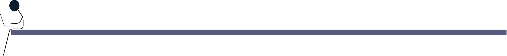

**Contents**

1. TOC
{:toc}

Recently I head about [The Lottery Ticket Hypothesis](https://arxiv.org/pdf/1803.03635.pdf) on [Machine Learning Street Talk](https://www.youtube.com/watch?v=SfjJoevBbjU). So like any Machine Learning Engineer worth their salt I watched [Yannic's](https://www.youtube.com/watch?v=ZVVnvZdUMUk) video and now consider myself equipt to improve on the idea. Dunning Kruger or Maverick Renegade, I'll let the void be the judge.

# The Lottery Ticket Hypothesis, Dot Point Version

  - Neural networks have a lot of parameters
  - This overparameterization should cause them to overfit all the time, but they don't ... hmmm
  - Pruning large proportions of weights can reduce model size and processing time while not sacrificing inference metrics, if we;
    1. Train model, remembering initialized weights
    2. After training, prune the smallest weights while keeping the large weights
    3. Retrain the pruned model ensuring you initialize the remaining weights to the same value they were the first time
    4. Repeat a few times
    5. The resulting sub-network has ~20% the weights of the original network
  - Inside each Neural network there are bazillions of potential sub-networks
  - The optimization process amplifies one of these sub-nets
  - The sub-net that wins out is contingent on the initial weights
  - Changing the initial weights will change the sub-net
  - Many of these sub-nets are equivalent, the one that falls out after optimization has won the lottery
  - Weights that end up in the final sub-net tend to have changed a lot during training
  - This is cool because it indicates we're not merely stumbling on the correct weights because we have a big model
  - The act of iteratively pruning combats this previously mentioned overparametizationleading to a better, smaller, faster model

# My Hypothesis

In the paper they; train -> prune -> repeat. Each time they prune they remove a portion of the smallest weigthts. Each time they retrain they do so for the same number of steps. This means your training the model many times, yes it's getting smaller each time, but still ... yuck. 

I'm thinking you could do the pruning after each epoch. Simply look at the weights with the least change or smallest value at the end of each epoch, remove them and continue training. I don't even think you'd need to reinitialize the weights to their starting value though I feel like you may need to be a bit conservative with the rate at which you prune.

_As a bit of a disclaimer, I'm pretty sure these guys would have considered this idea. When I say 'yuck' I'm not having a dig at their work. I get that you've gott'a draw a line in the sand an publish at some point. They'll probs beat me to the punch and have a better more thorough paper out before I get round to finishing this anyway._

# Building A Model To Test The Hypothesis

ToDo :-)
