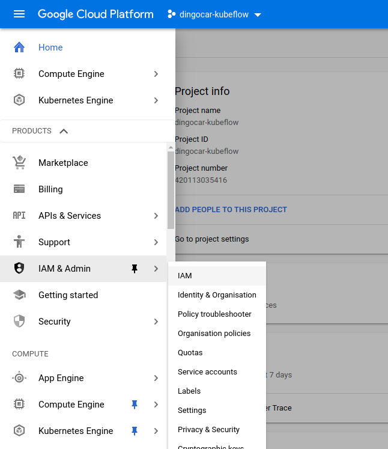
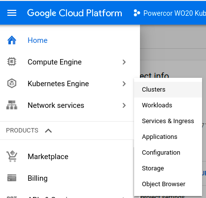
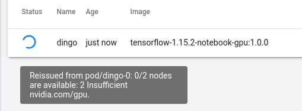
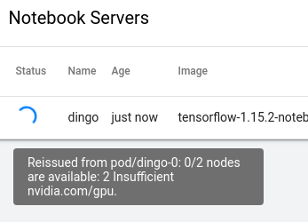

Kubeflow

# Kubeflow on GCP

In this post I intend to address the following:

0. [A short intro](# A Short Intro)
1. A VERY brief overview of Kubeflow. Anything more and I'd just be regurgitating the shpeal on the [home page](www,kubeflow.org) or [count](www.kubeflow.org) - [less](www.kubeflow.org) - [other](www.kubeflow.org) - [tutorials](www.kubeflow.org) - [and](www.kubeflow.org) - [stuff](ttps://medium.com/better-programming/kubeflow-pipelines-with-gpus-1af6a74ec2a).
2. First Impressions
2. How to setup Kubeflow on GPU's free trial tier
3. Create a Docker image that can be used in Kubeflow's Jupyter Notebook server. Puling it from either Google Cloud Regristry or Docker Hub (When I figure out AWS ECR I'll add it)
4. Create a Kubeflow pipeline using the Kubeflow pipeline python Domain Specific Language `kfp.dsl`. One of the pipeline component's Docker Images will be pulled from a private AWS ECR Regristry (Yep, I got this to work, but not the Jupyter Notebooks, go figure)

## A Short Intro

A few months ago a person I respect recomended I look into Tensorflow Extended (TFX). Well on that journey I got side tracked into learning about Kubeflow. You can run TFX pipelines in Kubeflow so the time is not wasted.

Recently I have become more and more intersted in ML-Ops. For the uninitaited, ML-Ops is _like_ Dev-Ops but with a particular focus on Machine Learning (ML) applications. There are two reasons ML-Ops has peaked my interest is the past year or so; Firstly, I am NOT a data scientist, nor am I a mathematisition or statistition but I work with some VERY smart people who are and when it comes to _doing the data science_ I just can't keep up. My background is robotics, I got into ML/AI because I wanted to make my robots smarter. Secondly, I have trouble remembering to pick up milk on the way home, never mind how to replicate an experiment I did a few weeks ago. Because of this I am a firm believer in using the right tool to make my life easier. 

## A VERY brief overview of Kubeflow

I shudder to regurigitate the same Kubeflow elevator pitch I've read a bajillion times over the past several weeks. What I want to do it show you how you can get started with Kubeflow on GCP for free, but I guess I'll have to set the scene. Kubeflow attempts to address many of the common steps in a model's life cycle. 


Kubeflow is not a beautifully pollished package that will solve all your ML woes. It is a collection of tools cobbled together ontop of Kubernetes. Much of the material I found on Kubeflow implies that you don't need any Kubernetes knowledge to get started with Kubeflow. This is _techically_ correct, but the moment you need to anything beyond the toy examples presented, dive a little deeper or try something different you probably won't have fun unless you're willing to dive into some Kubey goodness. 

## First Impressions

I quite like Kubeflow, from my experience it has not been too head to get things up an running. I went into this with zero Kubernetes experience and managed to get a cluster up and running on GCP in a few hours. This included a few trips to Git Issues and Google but we got there in the end (details below). 

I do feel Kubeflow is not for the new or intermediate developer. It's for those who are realitvly sophistocated and looking to scale their work across many machines. If you're a large organisation who does not have any internal GPU resources but you're familiar with Kubernetes and you want to do some Deep Learning then then Jupyter Notebook Server on Kubeflow seems like a natural choice. 

As for Kubeflow Pipelines, I realy like them, when they fit the task. If you're quite early in the devlopment cycle and you're still tweaking code ironing out bugs etc keep Kubeflow Pipelines out of it. Wait until you have a solid understanding of all steps in your pipeline. Will you be training in the pipeline? If not maybe [Cortex](https://www.cortex.dev/) would be more suited, the barrier to entry is MUCH lower. However, if you need Kubeflow Pipelines then they are very powerful, but you'll probably need to build some sophistication around Kubernetes to do anything other than toy experiments. 

## How to setup Kubeflow on GPU's free trial tier

Google offers a $300US trial teir. The setup is not too much different than what is outlined on the [official docs](todo) but there were some issues or assumed knowledge that tripped me up. So here we go.

1. **Setup a GCP account:** You will need to hand over your credit card but google will not charge you without you first agreeing when the trial is up.

2. **Activate The Required GCP APIs:** The officail instructions to [Setup a GCP Project](https://www.kubeflow.org/docs/gke/deploy/project-setup/) are pretty spot-on. Just a few things that tripped me up.
    - If you created the GCP project you're most likely the owner, but if you want to check. You can find your role in the Project by navigating to `IAM & Admin > IAM` on the side bar. 
    
    Here you sould see a table, locate the project you just created and check the role.

    - When you get to [Set up OAuth for Cloud IAP](https://www.kubeflow.org/docs/gke/deploy/oauth-setup/) If you add a logo to the _OAuth consent screen_ you will be told that Google needs to verify the app. Also, if you add a logo for some unknown reason you cannot remove it >:( . I did this the first time I setup OAuth and it still let me continue, it was just a point of confusion.
    
    - When you're done you will need to [Deploy using CLI](https://www.kubeflow.org/docs/gke/deploy/deploy-cli/).

3. **Deploy Using CLI:** [Here](https://www.kubeflow.org/docs/gke/deploy/deploy-cli)
    - When you get there use [this](https://raw.githubusercontent.com/kubeflow/manifests/master/kfdef/kfctl_gcp_iap.yaml) as the `CONFIG_URI`. The one the Kubeflow docs causes me and others problems, [this](https://github.com/kubeflow/kubeflow/issues/3230) git issue recomends you use the one provided above.
    - When you get to [Deploying Kubeflow](https://www.kubeflow.org/docs/gke/deploy/deploy-cli/#deploying-kubeflow). Use `kfctl build -V -f ${CONFIG_URI}` instead of `kfctl apply -V -f ${CONFIG_URI}`. This will create all the configurations you need without actually telling Kubernetes to spin up any infrastructure.
    - Edit `${KF_DIR}/kfctl_gcp_iap.yaml` see the snippet below:
        ```yaml
        imports:
        - path: cluster.jinja
        resources:
        - name: kubeflow
          properties:
            autoprovisioning-config:
              enabled: true
              max-accelerator:
              - count: 16                
                type: nvidia-tesla-p4  # Check your region has this resource
              max-cpu: 128
              max-memory: 2000
            cluster-version: "1.14"
            cpu-pool-enable-autoscaling: true
            cpu-pool-initialNodeCount: 2
            cpu-pool-machine-type: n1-standard-4   # Change this to n1-standard-4 or 2
            cpu-pool-max-nodes: 10
            cpu-pool-min-nodes: 0
            enable-workload-identity: true
            enable_tpu: false
            gkeApiVersion: v1beta1
            gpu-number-per-node: 1
            gpu-pool-enable-autoscaling: true
            gpu-pool-initialNodeCount: 0
            gpu-pool-machine-type: n1-standard-4   # Change this to n1-standard-4 or 2
            gpu-pool-max-nodes: 4
            gpu-pool-min-nodes: 0
            gpu-type: nvidia-tesla-p4  # Check your region has this resource
            identity-namespace: xxxxxxxxxxxxxxxxxxxxxxxxxxxxxx.svc.id.goog
            ipName: kubeflow-deployment-ip
            pool-version: v1
            securityConfig:
              masterAuthorizedNetworksConfigCidr:
              - cidrBlock: 1.2.3.4/32
              masterAuthorizedNetworksConfigEnabled: false
              masterIpv4CidrBlock: 172.16.0.16/28
              podSecurityPolicy: false
              privatecluster: false
              secureNodeMetadata: false
            users:
            - user:xxxxxxxxxxxxxxxxxxxxxxxxxxxxxxxxxxxxx
            zone: australia-southeast1-b    # Change the Zone if you need to. 
          type: cluster.jinja
        ```
        
    -  If/when you begin using multiple GPC accounts (ie: work/personal) you'll need to:
        - re-run the following two commands to tell `gcloud` what account to use `gcloud auth login` and `gcloud auth application-default login`. 
        - Also, to update the `kubectl` credentials you'll need to run do the following. 

            ```
            # This will take you through existing clusters and make you set one as default
            
            gclound init
            
            # Update ~/.kube/config with credentials of current gcloud cluster. Where
            # NAME is the cluster name. If you can't remember it you can find it at.
            # clound console > Kubernetes Engine > clusters  (fig 1)
            gcloud container clusters get-credentials $NAME
            ```
        
        This in condensed from Google Cloud docs [Cluster access for kubectl](https://cloud.google.com/kubernetes-engine/docs/how-to/cluster-access-for-kubectl).

        >Fig 1
        

## GPU Quotas

By default GCP assignes you're new account zero gpu resources. You need to request them to increase your gpu quota. Unforunately without this knowledge the error message you get when trying to launch a GPU Notebook
> GCP Error: Quota gpus all regions exceeded limit 0.0

was a bit confsing. Something like this would be much nicer. 

> Yo Fam, looks like your gpu quota is set to 0 for all regions. This is to stop you accidenty spinning up a bunch of gpus accidently and Google's big bad bill department sending you a billing for holla dollas. You can request an increase to your quota via your GCP console.

I have not tried this with the free teir, but you can give it a crack by navigating [here](https://support.google.com/cloud/answer/6075746). 


## Logging

I found debugging a bit of a pain. This was no doubt amplified by my lack of Kubernetes and GCP experience. For example, when launching a new jupyter notebook server clear and visible logs would be nice rather then having to dig around in the GCP console. Mousing over the spinner when the notebook server is launching does show some information, but it's no very helpful eg:


> Launching a gpu notebook server when I dont have gpu resources. Results in the same message as when I do have gpu resources. But when I don't have gpu resources the spinner just keeps on spinning indefinately. 
  

and, confusingliy ...

> Lauching a CPU notebook
  

Here are some helpful commands. (These really helped me when launching a custom Jupyter Notebook Server Container)

```bash
# get kubectl the credentils it needs to access the cluster (you should only need to run this once)
$ gcloud container clusters get-credentials <your-cluster-name> --zone=<your-cluster-zone>
 
# List to pods currently up
$ kubectl -n <kubeflow-namespace> get pods
 
# Show logs of Jupyter Notebook Server Container 
$ kubectl -n <kubeflow-namespace> notebooks <pod-name> <notebook-name>
 
# Show logs of pod as it's launching
$ kubectl -n <kubeflow-namespace> describe notebooks <notebook-name>
```

# Kubeflow Pipelines

As I mentioned earlier, I really like these but only once you're quite late in the model development cycle. There are some good samples provided in the [Kubeflow git repo ](https://github.com/kubeflow/pipelines/tree/master/samples). I have put together a sample pipeline at [my github](todo) that is heavily commented. This code constructs the below pipeline. 

- xxx. sets up the presistant volume that is shared by the other components in the pipeline.
- xxx. Tells the Kubernetes cluster about the AWS ECR credentials so we can pull an image from a private cluster
- xxx. This component download data from xxx and saved it in the shared volume
- xxx This component loads data from the shared volume and trains a model, saving logs for Tensorboard and checkpoints to the shared volume along the way.
- xxx Loads the model from the shared volume and validation data and performs model evaluation
- xxx sends a Slack message with metrics. Upon responce will launch the model server or not.


# Kubeflow Notebooks

These are just like normal Jupyter Notebooks 
